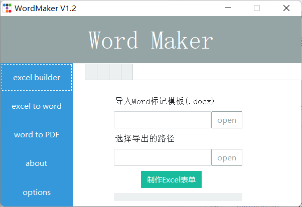

WordMaker 是一个自动批量生成word的GUI工具，根据自定义模板生成批量的Word文档，支持WPS.

WordMaker is an automatic batch Word generation tool that implements a series of processes from word template generation, excel data source template generation, excel data generation to word documents, etc. In order to free people from a large number of document production.

WordMaker 是一个自动批量生成word的工具，实现了从word模板生成、excel数据源模板生成、excel数据生成word文档等一系列流程。为了将人们从大量的文档制作中解放出来。

## help

1) 先确认自己word程序是WPS还是Office,并在options界面进行相应版本切换
2) 在word里面给关键字字体进行颜色标记(默认红色)
3) 在excel builder页面导入之前标记好的文档,然后制作excel数据源
4) 在excel to word页面进行批量生成word,分别要导入模板word和数据源,   选择excel行号区间设置生成数据的范围。
5) 在word to PDF进行批量word转换PDF操作,只须选择相应的文件目录就可以了
6) 注意: 执行过程前请先关闭相应的word/excel文件,执行过程中程序无响应是正常的,   请耐心等待程序执行完成直到弹出提示框,默认支持的文件类型:.docx/.xlsx
7) 关于配置文件：在设置的保存配置选项可以将当前选取的路径和设置选项保存在当前程序的本地目录下

## options

| key                   | selections                    | note                          |
| --------------------- | ----------------------------- | ----------------------------- |
| default_marking_color | 红色,黑色,蓝色,金色,绿色,黄色 | 支持识别模板标记的颜色        |
| default_api           | kWPS,WPS,Office               | 支持wps和office应用(默认kWPS) |

### attention

如果你的电脑上是使用wps就勾选kWPS或者WPS, 最好使用正式版本。

如果你的电脑上只有office word，没有安装wps，请在设置页面切换成office选项。

## functions

- excel builder

- excel to word
- word to PDF

## screenshot

## future

- 多线程
- 全自动化
